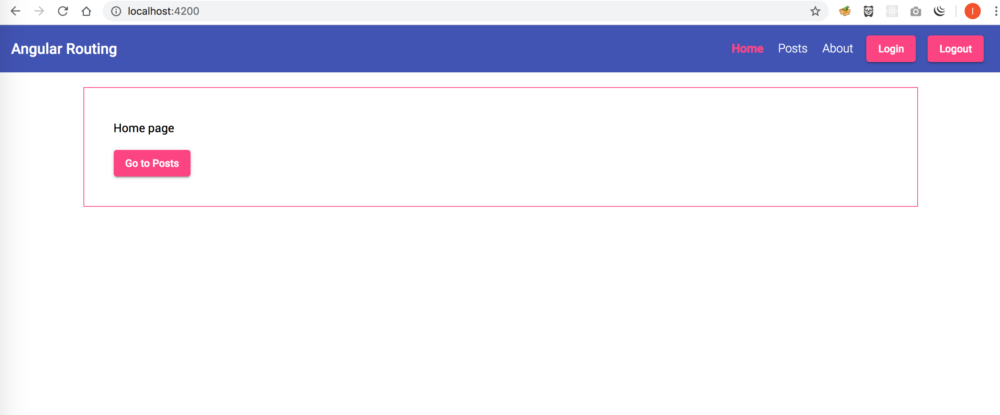
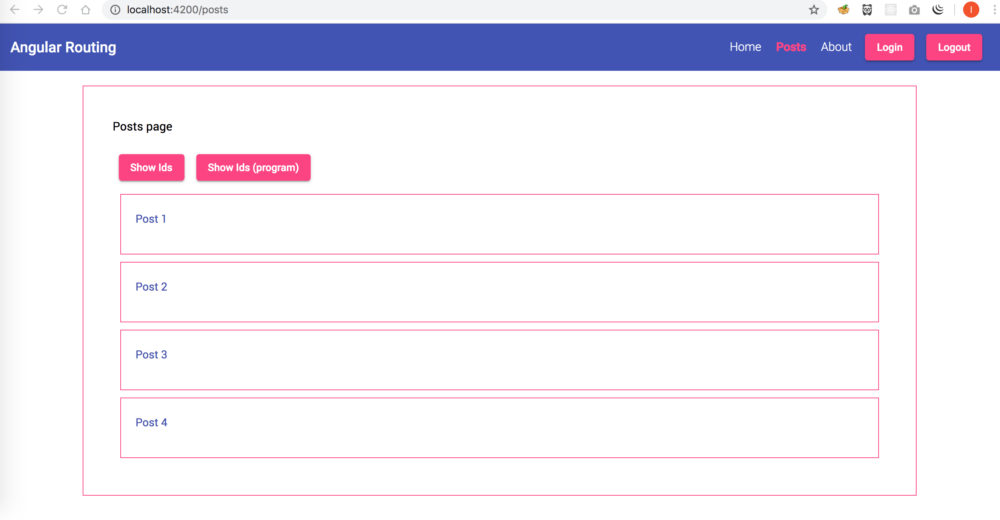
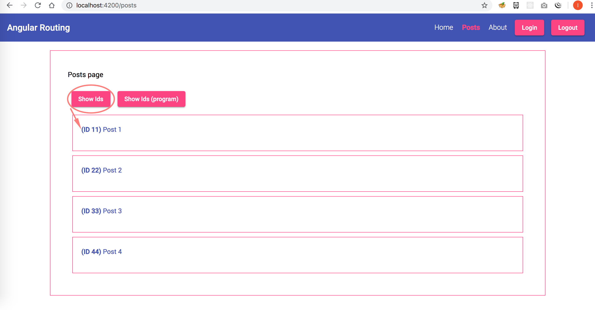
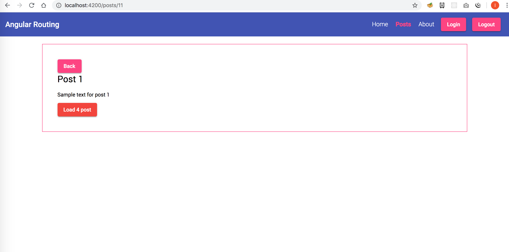
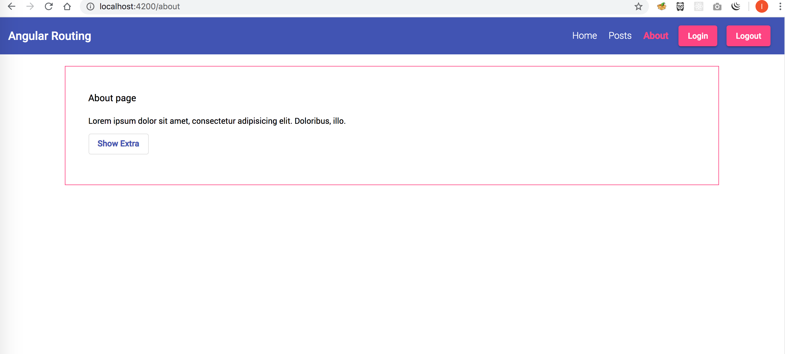
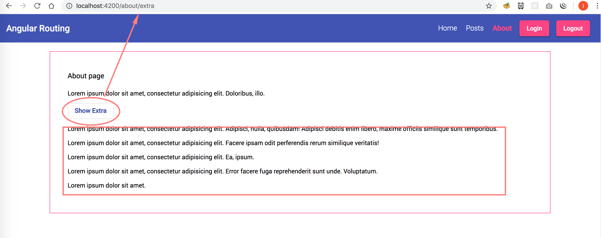

## Angular Routing

Routing allows you to map application requests to specific resources within the application.

The key to routing is the RouterModule module, which is located in the @angular/router package.

This project was generated with [Angular CLI](https://github.com/angular/angular-cli) version 9.1.3.

## Development server

Run `ng serve` for a dev server. Navigate to `http://localhost:4200/`. The app will automatically reload if you change any of the source files.

### Screenshots

